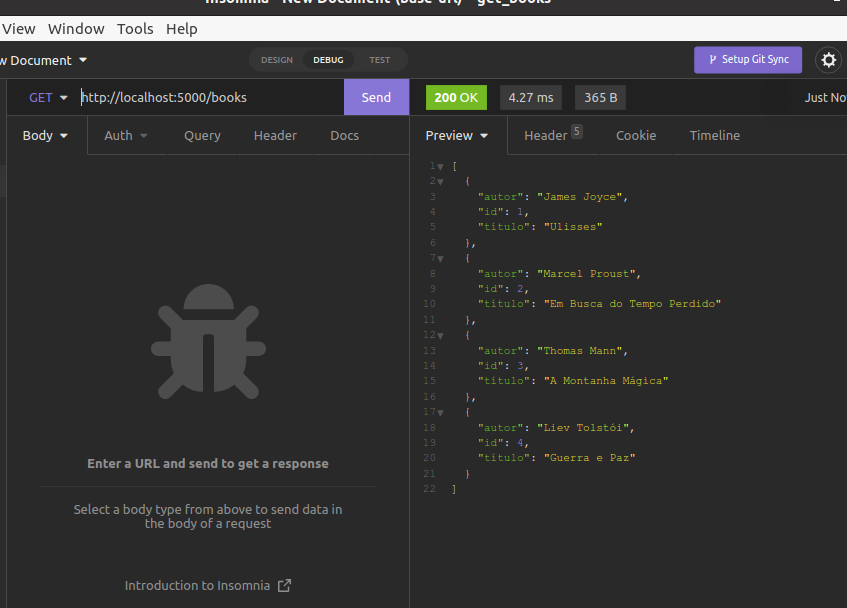
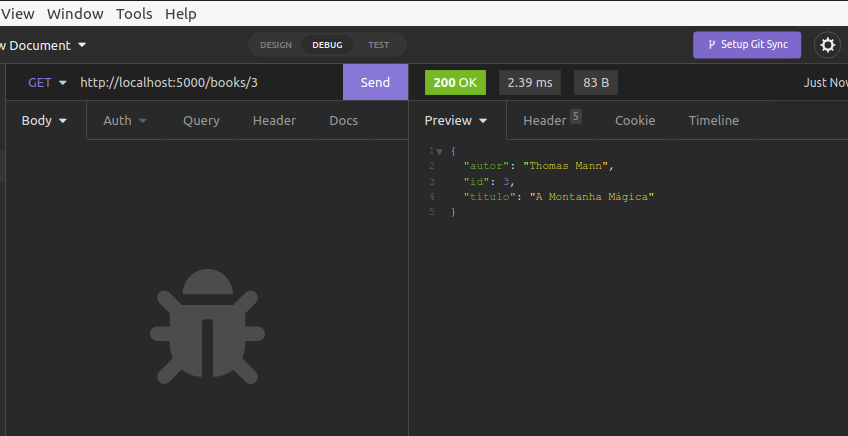
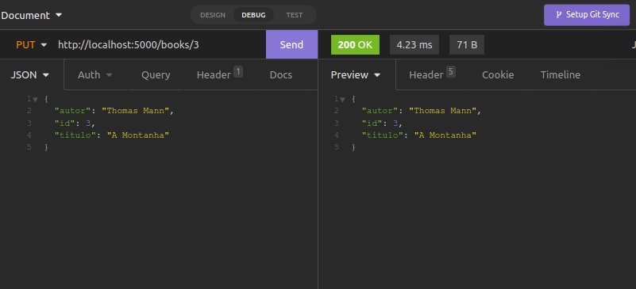
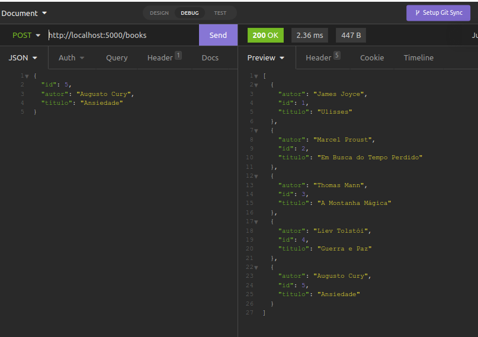
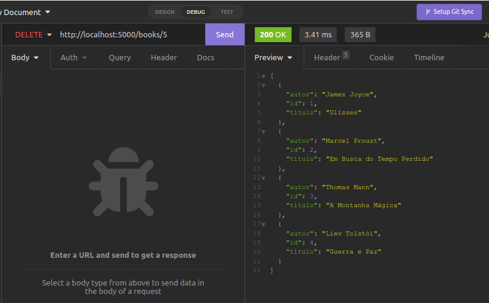

## Books API - v1

## CRUD de livros - Insomnia

### Objetivo:
- Criar api que permita a consulta, criação, edição e exclusão de livros

------
### URL base:
- localhost

------
### Endpoints:
- localhost/books - (GET)
- localhost/books/id - (POST)
- localhost/books/id - (GET)
- localhost/books/id - (PUT)
- localhost/books/id - (DELETE)

-----
### Recursos:
- Livros

-----
## Tecnologias utilizadas:

- python

- flask

- vscode

- insomnia

------

#### GET ALL BOOKS

-----
-----

#### GET BOOKS BY ID

-----
------
#### UPDATE BOOK BY ID

-----
------
#### INSERT NEW BOOK

-----
------

#### DELETE BOOK BY ID

